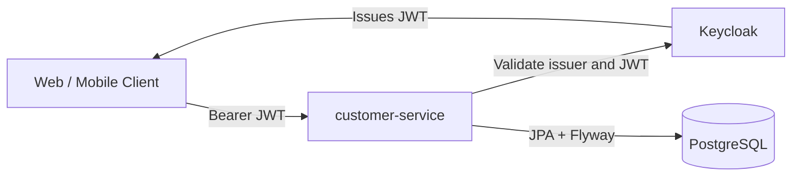
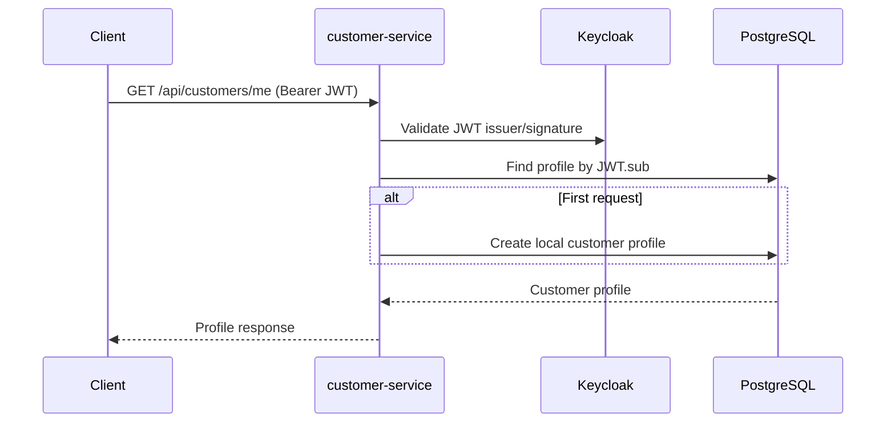
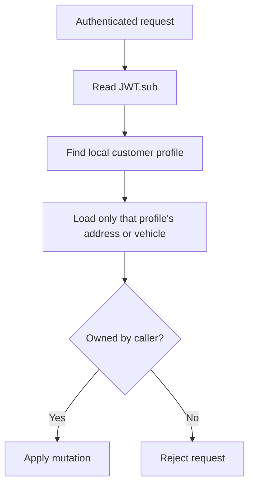
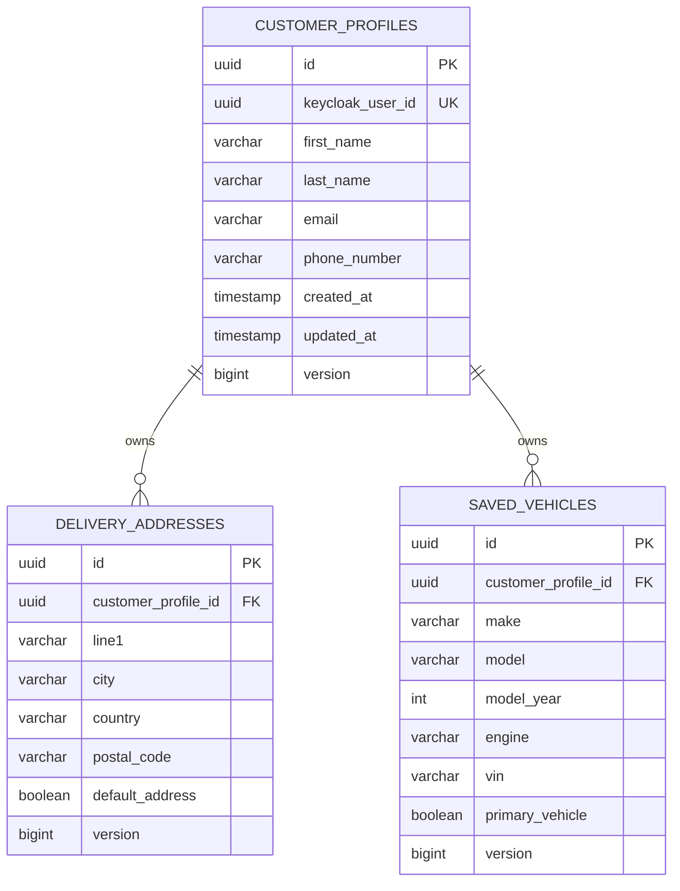

# SpareLink Customer Service

[](https://github.com/tadiwanashe-mashongwa/customer-service/actions/workflows/ci.yml)
[](https://github.com/tadiwanashe-mashongwa/customer-service/actions/workflows/ci.yml)
[](https://openjdk.org/projects/jdk/21/)
[](https://spring.io/projects/spring-boot)

Customer profile microservice for **SpareLink**, an automotive spare-parts platform. It links Keycloak identities to local customer data, manages delivery addresses and saved vehicles, and ensures every mutation belongs to the authenticated customer.

## Highlights

- Java 21, Spring Boot 3.5.5, PostgreSQL, Flyway, JPA/Hibernate
- Keycloak JWT resource-server security; customer identity is always derived from `JWT.sub`
- Customer profiles, delivery addresses, saved vehicles, primary/default selection
- Ownership-safe deletion and mutation rules
- OpenAPI/Swagger, Actuator, Docker, GitHub Actions, JaCoCo
- Testcontainers PostgreSQL repository tests with real Flyway migrations

## Architecture



## Customer profile flow



## Ownership rule



## Database model



## Local run

Start the complete SpareLink stack from the platform repository:

```powershell
docker compose up --build -d
```

Or run the service directly:

```powershell
$env:KEYCLOAK_ISSUER_URI = "http://localhost:8080/realms/sparelink"
mvn spring-boot:run
```

| Resource | URL |
|---|---|
| Customer API | `http://localhost:8085` |
| Swagger UI | `http://localhost:8085/swagger-ui/index.html` |
| OpenAPI JSON | `http://localhost:8085/v3/api-docs` |
| Health | `http://localhost:8085/actuator/health` |
| Keycloak | `http://localhost:8080` |

## API and access control

All `/api/**` endpoints require a Keycloak bearer token. Health and OpenAPI endpoints are public.

| Endpoint | Authenticated customer |
|---|---:|
| `GET /api/customers/me` | Read/create own profile |
| `PUT /api/customers/me` | Update own profile |
| `POST`, `GET /api/customers/me/addresses` | Add/list own addresses |
| `PUT /api/customers/me/addresses/{addressId}/default` | Select own default address |
| `DELETE /api/customers/me/addresses/{addressId}` | Delete own address |
| `POST`, `GET /api/customers/me/vehicles` | Add/list own vehicles |
| `PUT /api/customers/me/vehicles/{vehicleId}/primary` | Select own primary vehicle |
| `DELETE /api/customers/me/vehicles/{vehicleId}` | Delete own vehicle |

## Testing strategy

The suite follows TDD and uses the smallest realistic test layer for each behaviour:

| Layer | Scope |
|---|---|
| Unit | Profile, address and vehicle domain state changes |
| Service | Ownership filtering, deletion and primary/default selection |
| MVC slice | JWT subject propagation and validation |
| JPA slice | PostgreSQL repository queries with real Flyway migrations |

Run all tests:

```powershell
mvn test
```

The JaCoCo report is generated at `target/site/jacoco/index.html`. GitHub Actions uploads it and refreshes the coverage badge after a successful main-branch build.

## Project structure

```text
src/main/java/com/example/customerservice
├── profile         customer profile domain, API and persistence
├── address         delivery address domain, API and persistence
├── vehicle         saved vehicle domain, API and persistence
├── config          security and OpenAPI configuration
└── CustomerServiceApplication.java
```
